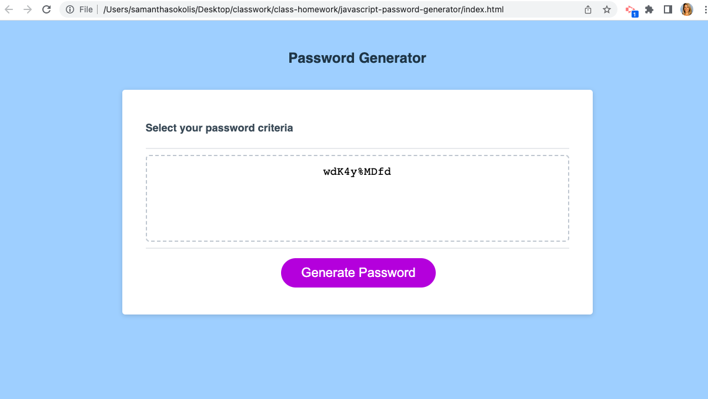

# Javascript Password Generator

## Description
An application that an employee can use to generate a random password based on selection criteria
URL: https://samantha-sokolis.github.io/javascript-password-generator/

## User Story
- AS AN employee with access to sensitive data
- I WANT to randomly generate a password that meets certain criteria
- SO THAT I can create a strong password that provides greater security

## Acceptance Criteria
GIVEN I need a new, secure password.
WHEN I click the button to generate a password,
THEN I am presented with a series of prompts for password criteria.
WHEN prompted for password criteria,
THEN I select which criteria to include in the password.
WHEN prompted for the length of the password,
THEN I choose a length of at least 8 characters and no more than 128 characters.
WHEN asked for character types to include in the password,
THEN I confirm whether or not to include lowercase, uppercase, numeric, and/or special characters.

## Image

